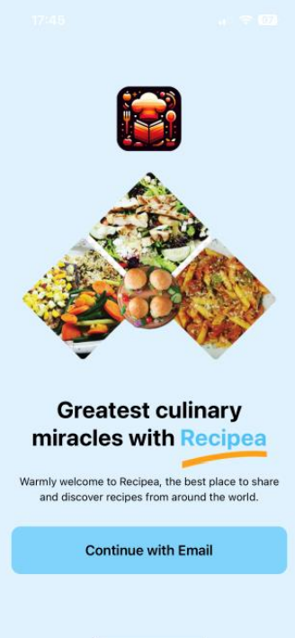
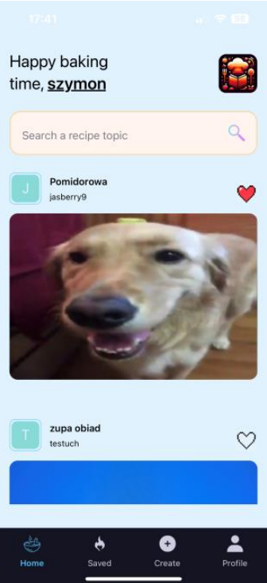
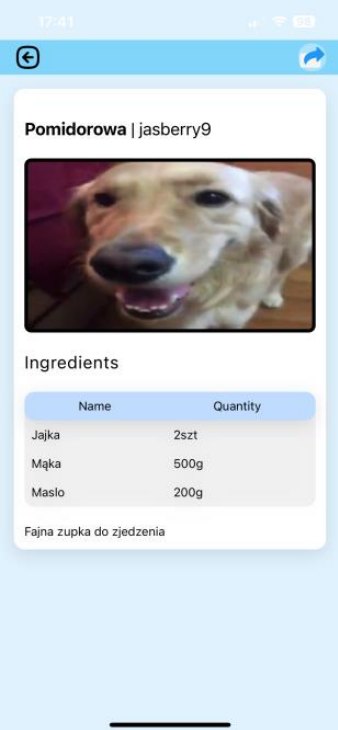
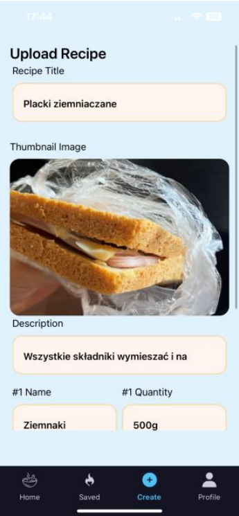
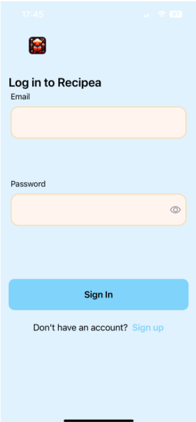
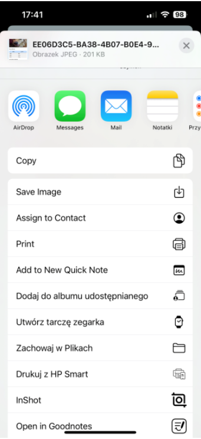

# Recipea Application Documentation

## 📋 <a name="table">Table of Contents</a>

1. 🤖 [Introduction](#introduction)
2. ⚙️ [Tech Stack](#tech-stack)
3. 🔋 [Features](#features)
4. 🤸 [Quick Start](#quick-start)
5. 🕸️ [Screenshots](#screenshots)
6. 🔗 [Links](#links)
7. 🚀 [More](#more)

## <a name="introduction">🤖 Introduction</a>

Recipea is an application designed for storing, creating, and discovering new recipes. The app was developed using React Native with the Expo framework, enabling it to operate on both Android and iOS platforms. The application features a minimalist design, with a color scheme consisting of sky-blue and sand, aligning with modern standards.

## <a name="tech-stack">⚙️ Tech Stack</a>

- React Native
- Expo

## <a name="features">🔋 Features</a>

👉 **User Authentication**
- **Login to the system**
- **Register to the system**

👉 **User Interface**
- **Welcome Screen for New Users**

👉 **Main Functionalities**
- **Home Screen**: Displays all user recipes
- **Recipe Search**: Allows users to search for specific recipes
- **Search Results**: Displays results based on the user's search query
- **Recipe Details**: Provides detailed information about a selected recipe
- **Recipe Sharing**: Allows users to share their favorite recipes
- **Favorite Recipes**: A tab where users can access their liked recipes

👉 **Recipe Management**
- **Add Recipe Tab**: Includes fields for title, photo, description, and ingredients
- **Confirmation of Added Recipe**
- **Display Added Recipe**: The newly added recipe appears on the home page and the user's profile
- **Edit and Delete Recipe**: Users can edit or delete their recipes

## <a name="quick-start">🤸 Quick Start</a>

Follow these steps to set up the project locally on your machine.

**Prerequisites**

Make sure you have the following installed on your machine:

- [Git](https://git-scm.com/)
- [Node.js](https://nodejs.org/en)
- [npm](https://www.npmjs.com/) (Node Package Manager)

**Cloning the Repository**

\`\`\`bash
git clone https://github.com/itsJasberry/recipea.git
cd recipea
\`\`\`

**Installation**

Install the project dependencies using npm:

\`\`\`bash
npm install
\`\`\`

**Running the Project**

\`\`\`bash
npm start
\`\`\`

**Expo Go**

Download the [Expo Go](https://expo.dev/go) app onto your device, then use it to scan the QR code from Terminal and run.

## <a name="screenshots">🕸️ Screenshots</a>

## <a name="links">🔗 Links</a>

- Project Repository: [GitHub](https://github.com/itsJasberry/recipea)
- License: [MIT License](https://opensource.org/licenses/MIT)

## <a name="more">🚀 More</a>

## License

This project is licensed under the MIT License [LICENSE](./LICENSE).

## Contact Information
Author: Szymon Grzesiak  